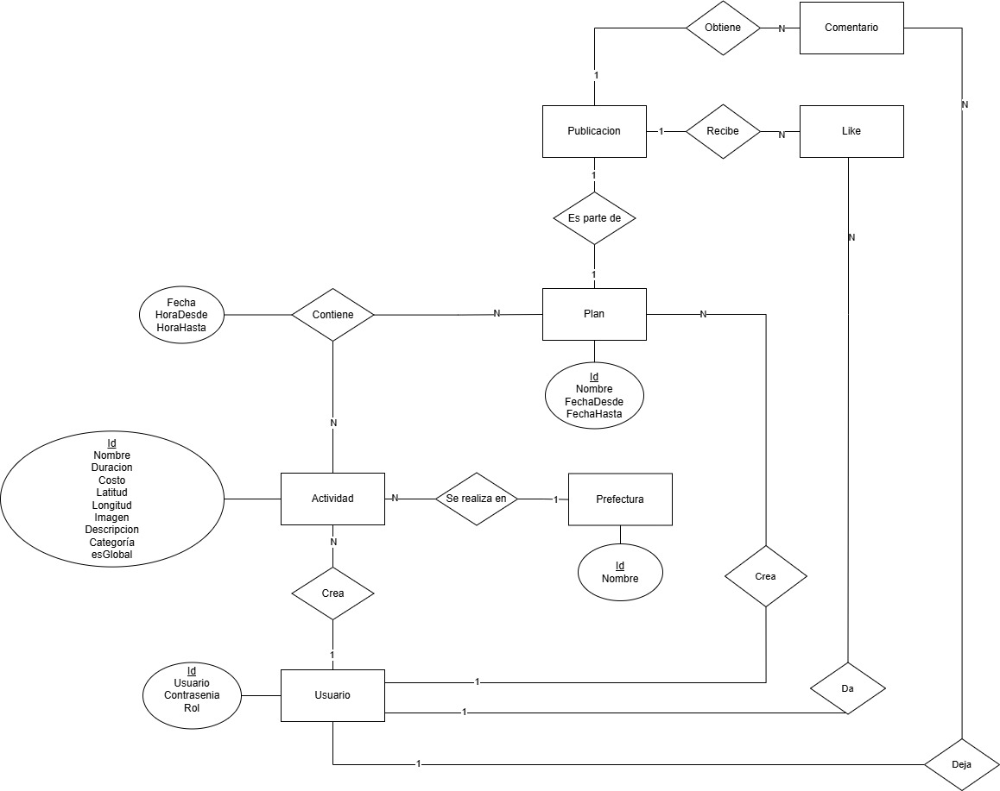

# Diseño del Modelo de Datos

## Sistema: Planificador de Viajes a Japón

# 1. Introducción

## 1.1 Propósito

El presente documento describe el modelo de datos del sistema “Planificador de Viajes a Japón”, incluyendo el modelo entidad-relación conceptual y su correspondiente transformación al modelo relacional.

El objetivo del documento es definir la estructura de datos necesaria para soportar las funcionalidades del sistema, garantizando integridad, consistencia y escalabilidad.

# 2. Modelo Entidad-Relación

  

  <em>Figura 1 - Modelo Entidad Relación</em>

# 3. Consideraciones de diseño

- Las actividades pueden reutilizarse en múltiples planes
- Las actividades pueden ser globales o personalizadas
- Los likes y comentarios se relacionan exclusivamente a publicaciones
- Se permite el solapamiento de actividades dentro de un mismo plan
- Las prefecturas se utilizan para soportar la exploración geográfica mediante mapa interactivo
- Las actividades almacenarán coordenadas geográficas para permitir integración con mapas
- El sistema utilizará Leaflet y OpenStreetMap para la selección y exploración geográfica
- Google Maps será utilizado únicamente como servicio externo de navegación
- El sistema utilizará borrado lógico en entidades relevantes para preservar integridad histórica

# 4. Entidades principales

- Usuario
- Plan
- Actividad
- Prefectura
- Publicacion
- Comentario
- Like
- PlanActividad

# 5. Relaciones principales

- Un usuario crea múltiples planes
- Un plan contiene múltiples actividades
- Una actividad puede pertenecer a múltiples planes
- Una actividad pertenece a una prefectura
- Un usuario puede crear múltiples actividades
- Un plan puede publicarse en el foro
- Una publicación puede recibir likes y comentarios
- Un usuario puede dar likes y comentar publicaciones

# 6. Descripción de entidades

## 6.1 Usuario

Representa a los usuarios registrados del sistema.

### Atributos

- id
- usuario
- passwordHash
- rol

---

## 6.2 Plan

Representa un viaje definido por un usuario.

### Atributos

- id
- nombre
- fechaDesde
- fechaHasta

---

## 6.3 Actividad

Representa una actividad turística o punto de interés.

### Atributos

- id
- nombre
- duracion
- costo
- direccion
- latitud
- longitud
- imagen
- descripcion
- categoria
- esGlobal

---

## 6.4 Prefectura

Representa una división territorial de Japón.

### Atributos

- id
- nombre

---

## 6.5 Publicacion

Representa la publicación de un plan dentro del foro.

---

## 6.6 Comentario

Representa un comentario realizado sobre una publicación.

---

## 6.7 Like

Representa la interacción de un usuario con una publicación.

---

## 6.8 PlanActividad

Representa la planificación temporal de actividades dentro de un plan.

### Atributos

- fecha
- horaDesde
- horaHasta

# 7. Transformación al modelo relacional

## Convenciones

- PK: Primary Key
- FK: Foreign Key

---

## 7.1 Usuario

- id: INT (PK)
- usuario: VARCHAR(50) UNIQUE NOT NULL
- password_hash: VARCHAR(255) NOT NULL
- rol: VARCHAR(20) NOT NULL

Restricciones:
- rol ∈ { ADMIN, USUARIO }

---

## 7.2 Plan

- id: INT (PK)
- nombre: VARCHAR(100) NOT NULL
- fecha_desde: DATE NOT NULL
- fecha_hasta: DATE NOT NULL
- usuario_id: INT (FK → Usuario.id)

---

## 7.3 Prefectura

- id: INT (PK)
- nombre: VARCHAR(100) UNIQUE NOT NULL

---

## 7.4 Actividad

- id: INT (PK)
- nombre: VARCHAR(100) NOT NULL
- duracion: INT NOT NULL
- costo: DECIMAL(10,2)
- direccion: VARCHAR(255) NOT NULL
- latitud: DECIMAL(9,6) NOT NULL
- longitud: DECIMAL(9,6) NOT NULL
- imagen: VARCHAR(255)
- descripcion: TEXT
- categoria: VARCHAR(50) NOT NULL
- es_global: BOOLEAN NOT NULL
- prefectura_id: INT (FK → Prefectura.id)
- usuario_id: INT (FK → Usuario.id)

Consideraciones:
- usuario_id será NULL para actividades globales
- usuario_id tendrá valor para actividades personalizadas

---

## 7.5 PlanActividad

- plan_id: INT (FK → Plan.id)
- actividad_id: INT (FK → Actividad.id)
- fecha: DATE NOT NULL
- hora_desde: TIME NOT NULL
- hora_hasta: TIME NOT NULL

Clave primaria compuesta:
- (plan_id, actividad_id, fecha, hora_desde)

---

## 7.6 Publicacion

- id: INT (PK)
- plan_id: INT UNIQUE (FK → Plan.id)

Restricciones:
- un plan solo puede tener una publicación

---

## 7.7 Comentario

- id: INT (PK)
- contenido: TEXT NOT NULL
- usuario_id: INT (FK → Usuario.id)
- publicacion_id: INT (FK → Publicacion.id)

---

## 7.8 Like

- usuario_id: INT (FK → Usuario.id)
- publicacion_id: INT (FK → Publicacion.id)

Clave primaria compuesta:
- (usuario_id, publicacion_id)

# 8. Restricciones e integridad

- Un usuario podrá tener un máximo de 8 planes
- Un plan podrá tener como máximo una publicación
- Un usuario podrá dar un único like por publicación
- Toda actividad deberá pertenecer obligatoriamente a una prefectura
- Las actividades globales serán administradas por usuarios con rol administrador
- Se permitirá el solapamiento de actividades dentro de un mismo plan
- Toda actividad deberá almacenar coordenadas geográficas válidas
- Los datos eliminados lógicamente deberán preservarse para mantener integridad histórica

# 9. Consideraciones finales

El modelo de datos propuesto busca representar de forma consistente y escalable las funcionalidades principales del sistema, manteniendo separación entre planificación de viajes, exploración geográfica e interacción social.

La incorporación de coordenadas geográficas permitirá futuras extensiones relacionadas con mapas interactivos, exploración visual y funcionalidades basadas en ubicación.

El diseño permite futuras extensiones del sistema sin requerir modificaciones estructurales significativas.