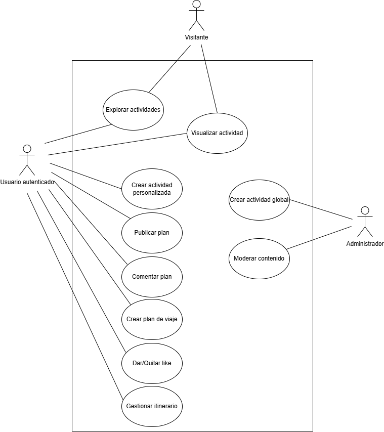

# Especificación de Casos de Uso

## Sistema: Planificador de Viajes a Japón

# 1. Introducción

## 1.1 Propósito

El presente documento describe en detalle los casos de uso del sistema “Planificador de Viajes a Japón”, definiendo las interacciones entre los actores y el sistema.

Este documento complementa la Especificación de Requerimientos del Sistema (SRS) y sirve como base para el diseño funcional y desarrollo.

## 1.2 Actores

- Visitante (no autenticado)
- Usuario registrado
- Administrador

# 2. Diagrama de Casos de Uso

  

  <em>Figura 1 - Diagrama de Casos de Uso</em>

# 3. Casos de uso

## UC01 – Crear plan de viaje

### Actor

Usuario registrado

### Descripción

Permite al usuario crear un nuevo plan de viaje.

### Precondiciones

- El usuario está autenticado

### Postcondiciones

- El plan queda registrado en el sistema

### Flujo básico

1. El usuario accede a la opción “Crear plan”
2. Ingresa nombre y fechas del viaje
3. Confirma la creación
4. El sistema valida el límite de planes
5. El sistema registra el plan
6. El sistema muestra el plan creado

### Flujos alternativos

#### 4.1 – Límite alcanzado

- El sistema muestra un mensaje de error
- Se cancela la operación

---

## UC02 – Gestionar actividades del plan

### Actor

Usuario registrado

### Descripción

Permite agregar actividades a un plan de viaje.

### Precondiciones

- El usuario está autenticado
- Existe un plan de viaje

### Postcondiciones

- La actividad queda asociada al plan

### Flujo básico

1. El usuario accede a un plan
2. Selecciona “Agregar actividad”
3. Busca o selecciona una actividad
4. Define fecha, hora y duración
5. Confirma la acción
6. El sistema agrega la actividad al plan

---

## UC03 – Explorar actividades por mapa

### Actor

Visitante / Usuario registrado

### Descripción

Permite visualizar actividades mediante un mapa interactivo de Japón.

### Precondiciones

- Ninguna

### Postcondiciones

- Se muestran actividades filtradas por prefectura

### Flujo básico

1. El usuario accede a “Explorar actividades”
2. El sistema muestra un mapa interactivo de Japón utilizando Leaflet y OpenStreetMap
3. El usuario selecciona una prefectura
4. El sistema muestra las actividades asociadas

---

## UC04 – Visualizar actividad

### Actor

Visitante / Usuario registrado

### Descripción

Permite visualizar los detalles de una actividad.

### Precondiciones

- Existe una actividad

### Postcondiciones

- Se muestra la información detallada

### Flujo básico

1. El usuario selecciona una actividad
2. El sistema muestra:
   - Descripción
   - Costo estimado
   - Duración
   - Categoría
3. El usuario selecciona “Ver ubicación”
4. El sistema abre la ubicación en Google Maps

---

## UC05 – Crear actividad personalizada

### Actor

Usuario registrado

### Descripción

Permite crear una actividad propia.

### Precondiciones

- Usuario autenticado

### Postcondiciones

- Actividad registrada como personalizada

### Flujo básico

1. El usuario accede a “Crear actividad”
2. Ingresa los datos de la actividad
3. Selecciona una ubicación en el mapa interactivo
4. Confirma la creación
5. El sistema registra la actividad

---

## UC06 – Seleccionar ubicación geográfica

### Actor

Usuario registrado / Administrador

### Descripción

Permite seleccionar una ubicación geográfica mediante un mapa interactivo al crear o modificar una actividad.

### Precondiciones

- Usuario autenticado
- El usuario se encuentra creando o editando una actividad

### Postcondiciones

- La actividad queda asociada a coordenadas geográficas

### Flujo básico

1. El usuario accede al formulario de actividad
2. El sistema muestra un mapa interactivo
3. El usuario selecciona una ubicación en el mapa
4. El sistema obtiene latitud y longitud
5. El sistema registra la ubicación seleccionada

---

## UC07 – Publicar plan

### Actor

Usuario registrado

### Descripción

Permite publicar un plan en el foro.

### Precondiciones

- Usuario autenticado
- El plan existe

### Postcondiciones

- El plan es visible en el foro

### Flujo básico

1. El usuario accede a un plan
2. Selecciona “Publicar”
3. Confirma la acción
4. El sistema publica el plan

### Flujos alternativos

#### 2.1 – Plan ya publicado

- El sistema informa que el plan ya está publicado

---

## UC08 – Dar/Quitar like

### Actor

Usuario registrado

### Descripción

Permite interactuar con planes mediante likes.

### Precondiciones

- Usuario autenticado
- Plan publicado

### Postcondiciones

- Se actualiza el contador de likes

### Flujo básico (dar like)

1. El usuario selecciona “Like”
2. El sistema registra el like

### Flujo alternativo (quitar like)

1. El usuario vuelve a seleccionar “Like”
2. El sistema elimina el like

---

## UC09 – Comentar plan

### Actor

Usuario registrado

### Descripción

Permite comentar un plan publicado.

### Precondiciones

- Usuario autenticado
- Plan publicado

### Postcondiciones

- Comentario registrado

### Flujo básico

1. El usuario escribe un comentario
2. Envía el comentario
3. El sistema lo registra y lo muestra

---

## UC10 – Moderar contenido

### Actor

Administrador

### Descripción

Permite eliminar contenido inapropiado del foro.

### Precondiciones

- Administrador autenticado

### Postcondiciones

- Publicación eliminada

### Flujo básico

1. El administrador accede al foro
2. Selecciona un plan publicado
3. Ejecuta la acción de eliminación
4. El sistema elimina el contenido

---

## UC11 – Crear actividad global

### Actor

Administrador

### Descripción

Permite crear actividades visibles para todos los usuarios.

### Precondiciones

- Administrador autenticado

### Postcondiciones

- Actividad disponible globalmente

### Flujo básico

1. El administrador accede a “Crear actividad”
2. Ingresa los datos
3. Selecciona una ubicación en el mapa interactivo
4. Confirma la creación
5. El sistema registra la actividad

# 4. Consideraciones finales

Los casos de uso definidos representan las principales interacciones entre los actores y el sistema, cubriendo tanto la planificación de viajes como la exploración geográfica e interacción social dentro del foro.

La integración de Leaflet y OpenStreetMap permitirá implementar funcionalidades geográficas de manera flexible y escalable, mientras que Google Maps será utilizado como servicio externo de navegación.

Este documento servirá como base para el diseño detallado y desarrollo del sistema.